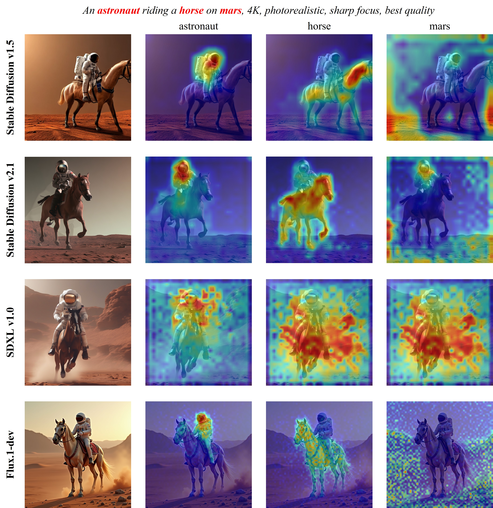

# Diffusion Attention Visualization

This repository provides to visualize the attention maps in diffusion models.

The following models are fully tested:

- [stable-diffusion-v1-4](https://huggingface.co/CompVis/stable-diffusion-v1-4)
- [stable-diffusion-v1-5](https://huggingface.co/stable-diffusion-v1-5/stable-diffusion-v1-5)
- [stable-diffusion-v2-1](https://huggingface.co/stabilityai/stable-diffusion-2-1)
- [stable-diffusion-xl-base-1.0](https://huggingface.co/stabilityai/stable-diffusion-xl-base-1.0)
- [FLUX.1-dev](https://huggingface.co/black-forest-labs/FLUX.1-dev)


## Installation

Create a `conda` environment:

```bash
conda create -n vis_attn python=3.10
conda activate pytorch
```

Install pytorch:

```bash
conda install pytorch==2.2.0 torchvision==0.17.0 torchaudio==2.2.0 pytorch-cuda=11.8 -c pytorch -c nvidia
```

Install other packages:

```bash
pip install -r requirements.txt
```


## Usage

Clone this repository:

```bash
git clone https://github.com/wmchen/vis_diffusion_attention.git
```

Run the demo:

```bash
cd vis_diffusion_attention/

python main.py --config config/vis_flux_cross_attention.toml --offload
```

## Showcase


